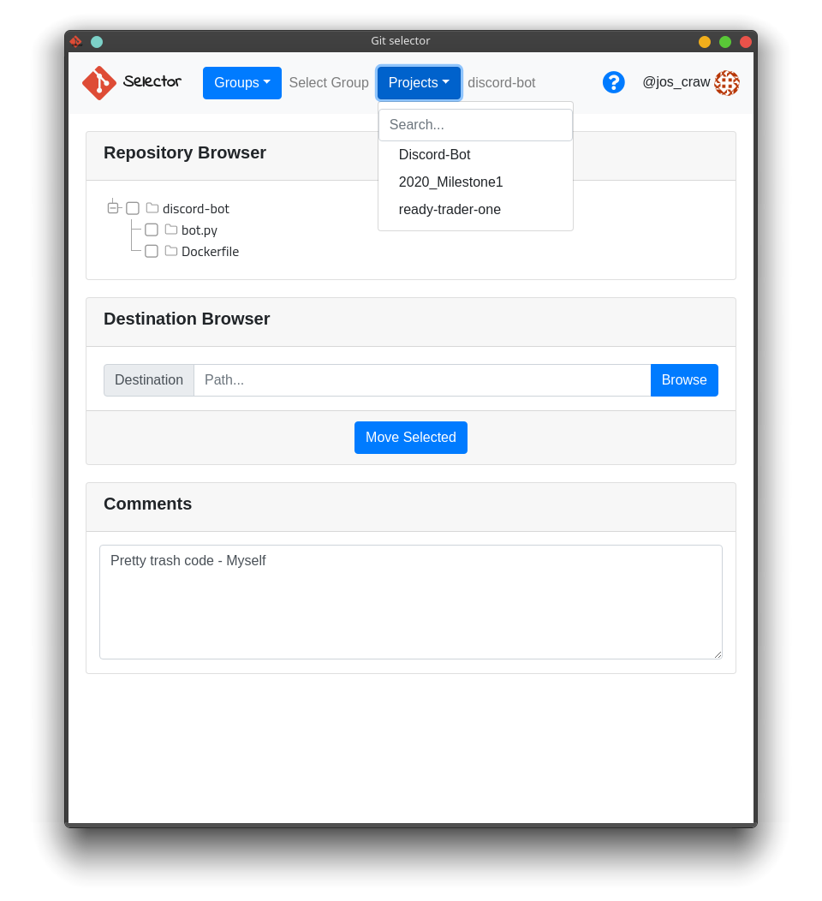
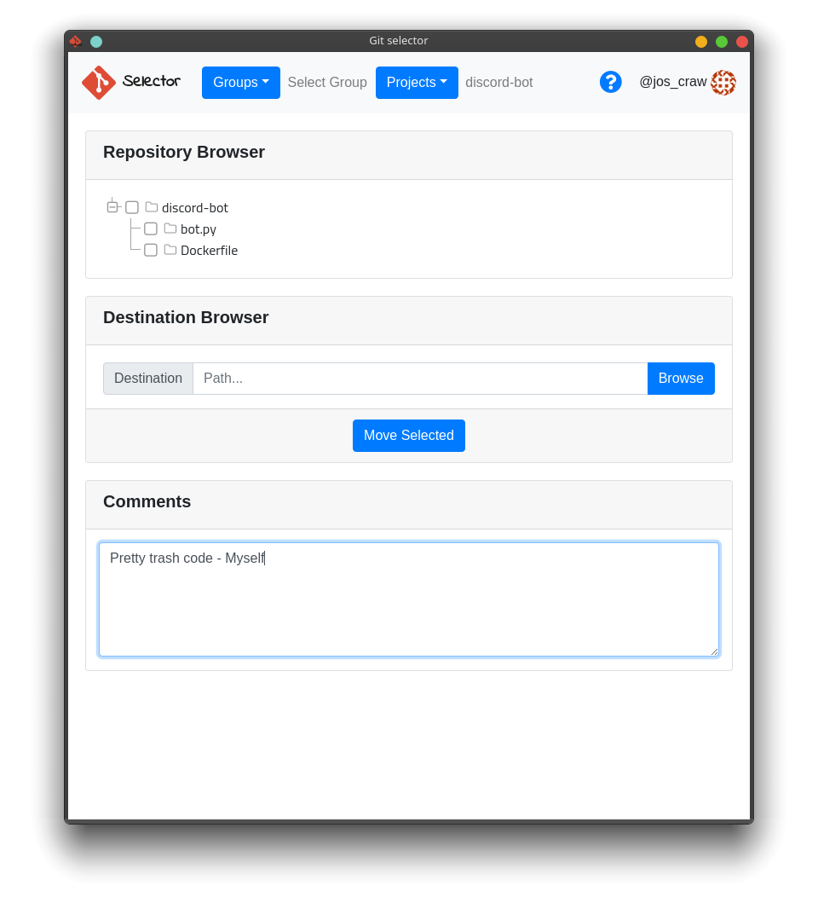
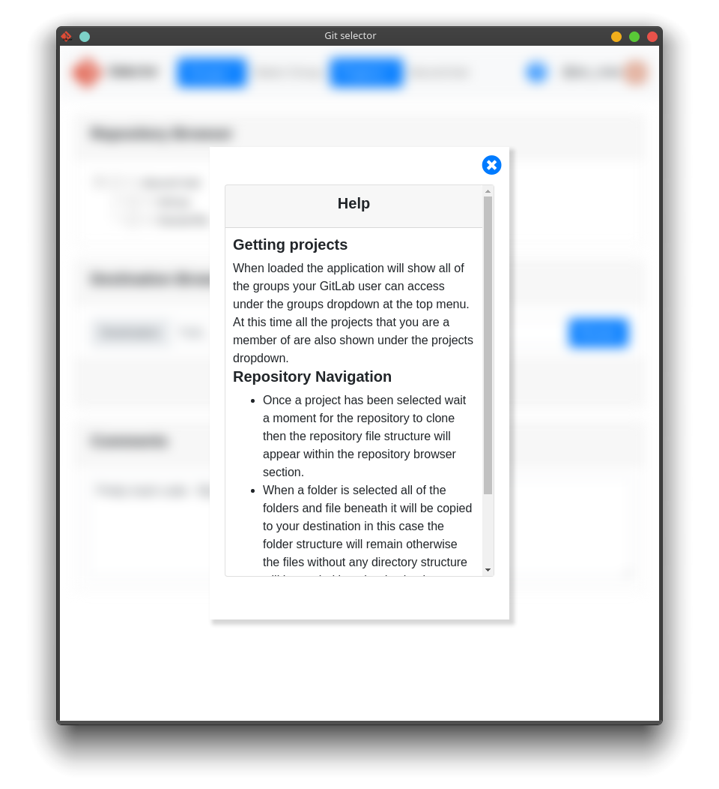
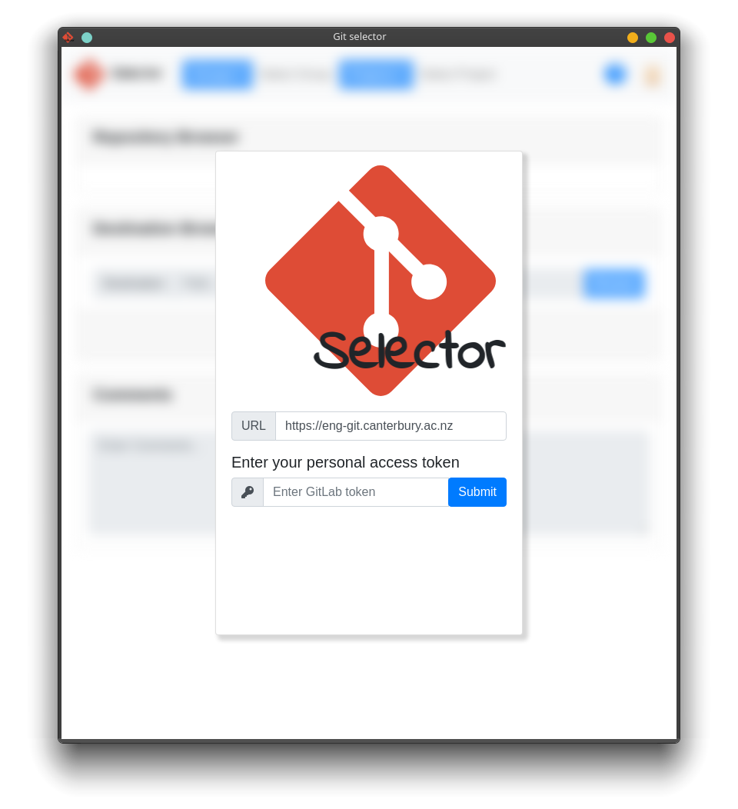
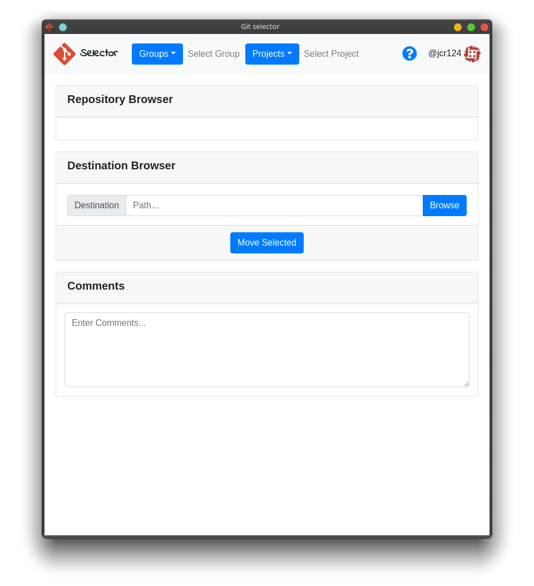
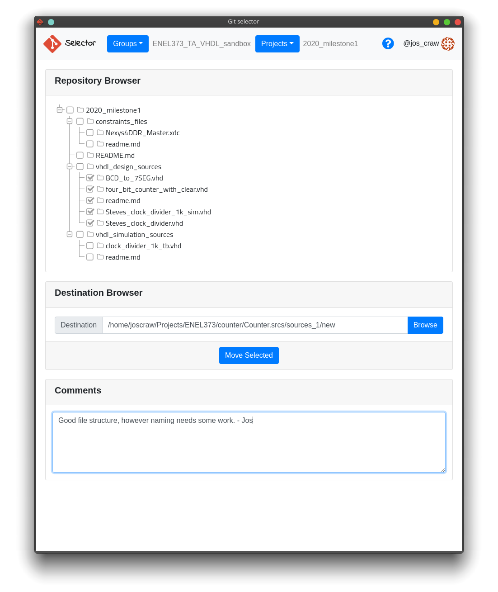

# Git Selector

This App is designed to revolutionize the world of Zoom tutoring :smile: , not really but I wanted an excuse to try Electron so I made this. :gem:

## Contents
1.  [The App](#app)
2.  [Installation](#install)
    -   [Running from source](#source)
    -   [Downloads](#downloads)
3.  [Usage](#use)
4.  [TODO](#todo)
5.  [Author](#author)

## Images

First some pretty (I think) pictures :camera:

|                                |                                |                                |
| -------------------------------|--------------------------------|--------------------------------|
|  |  |  |


<a name="app"></a>

## 1. The App
This app is designed to make tutoring University coding courses a little bit easier, specifically ENCE361 and ENEL373 at the University of Canterbury.
It does this by giving a GUI for searching through GitLab groups and projects and cloning them into a temporary location and displaying a directory structure for the repository.
This makes the process of getting the students code into a template such as [CMake](https://git.sys-io.net/projects/ENCE361/repos/tiva-cmake-template) (like for ENCE361)
The app also supports local commenting making it easier to catchup to where you left off.

<a name="install"></a>

## 2. Installation
Ensure that NPM is installed on your machine and run the following command:

```console
user@computer:~$ npm run dist //This Command will, by default build for both Linux and Windows
```

On Windows you can run this command from git bash once NPM is installed

I have found some issues with native windows packaging however luckily I have included a working Windows executable in [downloads](#downloads), it seems like if you have a space in 
your user name it causes npm to fail.

This will create the packaged files in `dist/`

This dist command will by default build for Windows and Linux, to change this go to [package.json](package.json) and change the `"dist"` command under `"scripts"` to `"electron-builder -w"` for Windows `-m` for Mac etc.

This command will package the program based on the contents of `build` in [package.json](package.json) to, for example, only build .AppImage replace the target in Linux to:
```json
{
    "linux": {
        "...": "...",
        "target": "AppImage"
    }
}
```

Or to build NSIS and portable for Windows use:
```json
{
    "win": {
        "target": [
            "nsis",
            "portable"
        ],
        "...": "..."
    }
}
```

<a name="source"></a>

### Running from source
Running for source should work automatically for all Operating Systems (Untested)
```console
user@computer:~$ npm run start
```
This command executes both `npm install` and `electron .` the available commands can be found in `package.json`

<a name="downloads"></a>

### Downloads
-   Linux
    -   [Zip](https://storage.googleapis.com/git-selector/v0.1.0/Git%20Selector%200.1.0-linux.zip) (Full unpackaged Zip, the file is big)
    -   [AppImage](https://storage.googleapis.com/git-selector/v0.1.0/Git%20Selector%20Application-0.1.0.AppImage) AppImage Executable (Recommended)
-   Windows
    -   [Portable](https://storage.googleapis.com/git-selector/v0.1.0/Git%20Selector%20Application%200.1.0.exe)
    -   [Installer](https://storage.googleapis.com/git-selector/v0.1.0/Git%20Selector%20Application%20Setup%200.1.0.exe)
    -   [Zip](https://storage.googleapis.com/git-selector/v0.1.0/Git%20Selector%200.1.0-win.zip)
-   [Mac](#downloads) (Sorry I don't have a Mac so I can't build for Mac)

<a name="use"></a>

## 3. Usage
This section will be mostly pictures :tada:



To access get in all you need to do is enter the GitLab URL for the instance you are connecting to (for these examples I will be using the University of Canterbury Eng Git Server)
and the personal access token for your account on the given server find out how to make one [here](https://docs.gitlab.com/ee/user/profile/personal_access_tokens.html#creating-a-personal-access-token).

The software also expects you to be using git with ssh.



Once you enter your token and hit submit this screen will be available the top navigation bar contains two drop downs, these allow you to search and select the group/project you would like to work with. A help icon is also located on this navbar.



This shows the app with an ENEL373 test repository in this example I am copying VHDL design sources into a setup project, this case makes it easier to quickly copy many students code into a demo project.

<a name="todo"></a>

## 4. TODO
:negative_squared_cross_mark: Use paging on GitLab API to make projects and groups load in gradually and not limit to first 100 projects

:negative_squared_cross_mark: Use portable git for linux so packaged versions and installs without git can access git

:pencil2: Add preferences Eg. Stored token and URL

:pencil2: Allow users to clear selections, Eg. Selected Group

:negative_squared_cross_mark: Add portable git for windows

:pencil2: Test on MacOS

:negative_squared_cross_mark: Test on Windows

:pencil2: Add Branch support

:pencil2: Make the comments centrally available

:pencil2: Automatically build executable with CI (started but not finished yet)

:pencil2: Create unit tests


Get it, penciled in, I crack myself up :laughing:

Yes I just discovered emojis in BitBucket that why there are so many

<a name="author"></a>

## 5. Author
Jos Craw <jos@joscraw.net>
